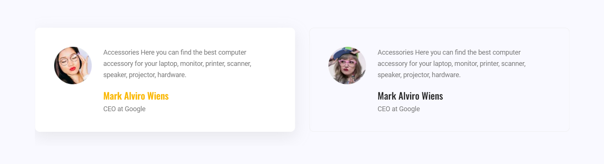
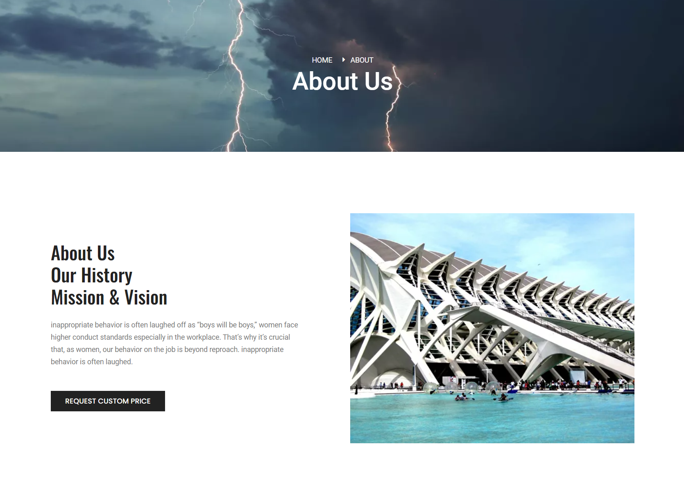
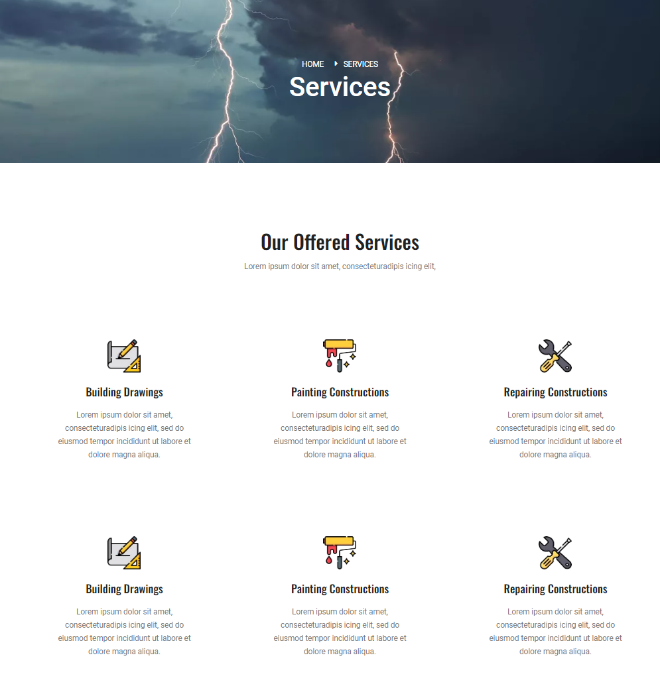

# Darysim svetaine

### https://preview.colorlib.com/theme/builder/index.html

- Darysim tik desktop versija.
- kiekvienos sekcijos css bus atskirame faile css-parts direktorijoje

## layout

1. headeris
2. footeris

## bendros sekcijos

kuriam page-parts direktorijoje html failus

bendros sekcijos turetutureti css kuris neprateka niekur kitur.

1. Meet Our Expert Members 
2. Skaitliukai 
3. Atslipiepimai 
4. Remejai 

## About page

1. daryti tik 
2. prideti likusias sekcijas kai jos bus baigtos

## Services page

1. daryti tik 
2. prideti likusias sekcijas kai jos bus baigtos
